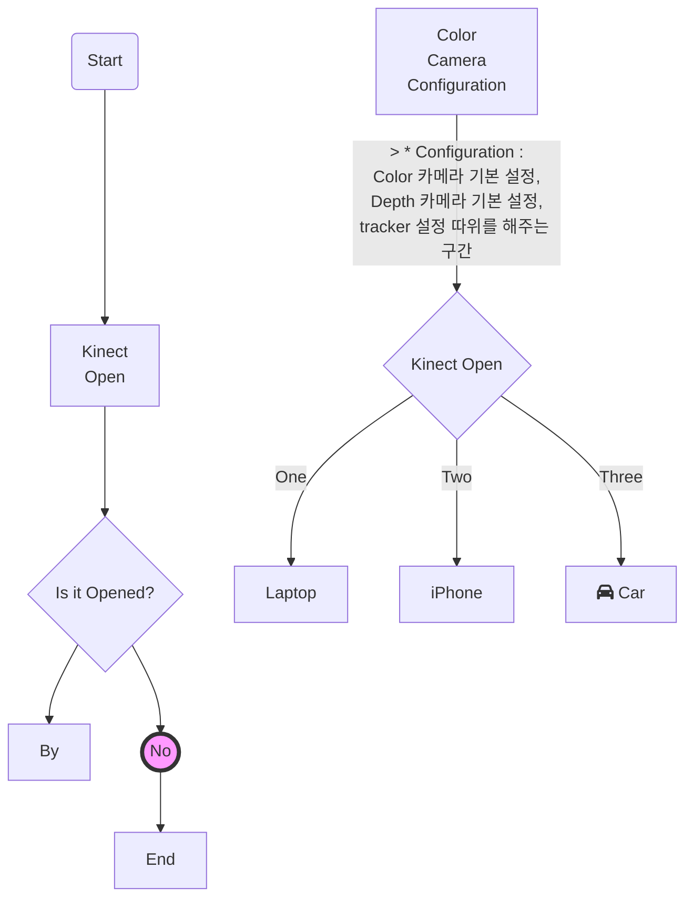

```mermaid
graph TD
    A(Start) --> 
    B[Kinect<br>Open] -->
    BQ{Is it Opened?} --> By
    BQ --> Bn((No)) --> End
    Z[Color <br>Camera<br> Configuration]-->
    |> * Configuration :<br> Color 카메라 기본 설정, Depth 카메라 기본 설정,<br>tracker 설정 따위를 해주는 구간 | C{Kinect Open}
    C -->|One| D[Laptop]
    C -->|Two| E[iPhone]
    C -->|Three| F[fa:fa-car Car]

    style Bn fill:#f9f,stroke:#333,stroke-width:4px
```
